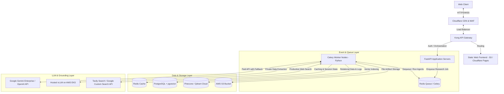

# Part 3 — Recommendation Report
## Production-Grade Architecture, Infrastructure Estimation, and Scale Strategy

This report details the recommended production architecture, infrastructure costs, operational risks, and scalability blueprints for transitioning the **AI Research Assistant** from our current working proof-of-concept into an enterprise-grade cloud system.

---

### 1. Recommended Production Architecture

For an enterprise deployment, the architecture transitions from a single-machine script/server into a decoupled, highly available, and event-driven microservices architecture. 

#### Core Components & Technical Stack:
1.  **Frontend Hosting**: React/Next.js hosted on **Vercel** or **Cloudflare Pages** for global distribution, sub-second loads, and CDN edge caching.
2.  **API Gateway & Load Balancing**: **Kong API Gateway** or **AWS ALB** to handle authentication (OAuth2 / JWT), API rate limiting, telemetry injection, and secure routing.
3.  **App & Worker Orchestration**: **FastAPI** as the lightweight gateway server. **Celery with Redis** as the asynchronous job manager. Agentic workloads can run up to several minutes, so they must be executed out-of-band in worker queues rather than synchronously inside an HTTP request.
4.  **Database & Storage**:
    *   **PostgreSQL with pgvector**: For structured user management, history, and metadata. pgvector provides vector indexing on the same database.
    *   **Qdrant / Pinecone**: Dedicated vector database for fast, production-scale RAG index searches across millions of documents.
    *   **AWS S3**: To store raw PDF uploads and exported Markdown/PDF reports.
5.  **Multi-Agent Framework**: **LangGraph** or **Temporal.io** for managing complex stateful agent steps, enabling retries, error recovery, and robust execution tracking.

---

### 2. Estimated Infrastructure & API Costs

We break down operational costs into three growth stages.

#### Stage A: Developer / POC Phase (Current Setup)
*   **Target Capacity**: 1–2 concurrent users, ~50 research runs/day.
*   **Infrastructure Details**: Running locally or on a single free-tier VM (e.g., Render or Fly.io free tier).
*   **API Cost**: $0.00 (utilizing Gemini Free Tier and DuckDuckGo API-key-less search).
*   **Total Cost**: **$0 / month**.

#### Stage B: Growth / Startup Phase
*   **Target Capacity**: ~500 monthly active users (MAUs), ~15,000 research reports/month.
*   **Infrastructure Setup**:
    *   Application Servers: 2x AWS EC2 `t3.medium` instances (managed via ECS) — $50/mo.
    *   Queue & Cache: Redis on AWS ElastiCache — $30/mo.
    *   Database: Amazon RDS PostgreSQL (db.t3.medium, Multi-AZ) — $60/mo.
    *   Vector Search: Pinecone (Standard Starter / Basic Tier) — $70/mo.
    *   Search Grounding: Tavily Search API (150k searches/mo) — $150/mo.
    *   Storage: AWS S3 — $10/mo.
*   **LLM API Cost**:
    *   Gemini 2.0 Flash Pay-As-You-Go: $0.075 / 1M input tokens, $0.30 / 1M output tokens.
    *   Average tokens per research run: 50,000 input tokens, 4,000 output tokens.
    *   Cost per run: $(50,000 \times 0.000000075) + (4,000 \times 0.0000003) = $0.00375 + $0.0012 = **$0.00495** (less than half a cent!).
    *   For 15,000 runs: $0.00495 \times 15,000 \approx $75/mo.
*   **Total Estimated Cost**: **~$445 / month**.

#### Stage C: Enterprise Scale
*   **Target Capacity**: ~20,000 active corporate users, high-security requirements, private local LLM processing option.
*   **Infrastructure Setup**:
    *   Kubernetes Cluster (AWS EKS, multi-region auto-scaling) — $600/mo.
    *   Database: AWS Aurora Serverless PG + High-Performance Qdrant Cluster — $1,200/mo.
    *   Search Grounding: Google Custom Search Enterprise — $1,500/mo.
    *   Local Private Inference: 2x AWS EC2 `g5.4xlarge` (with NVIDIA A10G GPU running vLLM for private data RAG) — $1,800/mo.
    *   Monitoring & Log Analytics: Datadog / New Relic — $400/mo.
*   **LLM API Cost** (Heavy use + Gemini Pro fallback): ~$3,500/mo.
*   **Total Estimated Cost**: **~$9,000 / month**.

---

### 3. Key Risks & Mitigation Strategies

#### Risk 1: Hallucinations and Incorrect Grounding
*   *Detail*: Multi-agent synthesizers can hallucinate connections between search snippets, leading to false research claims.
*   *Mitigation*: Implement strict **Self-RAG and Verification loops**. The `RefinementAgent` acts as a factual gatekeeper, parsing the draft and programmatically matching assertions against retrieved sources. If an assertion has no source citation, the agent removes it or requests a re-search.

#### Risk 2: Rate Limits and Exhausted Quotas
*   *Detail*: The Gemini Free tier allows 15 requests per minute. If a multi-agent loop executes 4 agents sequentially with multiple sub-searches, 2 concurrent users can exhaust the quota, triggering HTTP 429 errors.
*   *Mitigation*: Implement **Token Leaky Bucket algorithms** at the API gateway. Provide **seamless fallbacks to secondary LLMs** (e.g., fallback to a local Ollama instance or secondary free models on Hugging Face/Groq) if a 429 status code is received.

#### Risk 3: Data Leakage and Confidentiality
*   *Detail*: Enterprise researchers might upload proprietary corporate files for RAG. If cloud APIs (like free Gemini) are used, this data might be processed or stored by external providers for training.
*   *Mitigation*: Set up a **Data Governance Policy engine** in the backend. Detect sensitive file uploads (using PII scrubbers) and dynamically route all confidential documents through local **Ollama/vLLM endpoints** hosted on private, VPC-secured GPU servers.

---

### 4. How the System Scales in Production

To scale the AI Research Assistant to handle tens of thousands of simultaneous users without system slowdown:

1.  **State Management & Agent Resumeability**:
    *   Agents should not hold execution state in memory. By using **LangGraph state charts** stored in Postgres/Redis, if a worker node crashes mid-research, another node can instantly pick up the execution from the exact step (e.g., resuming from *Synthesizer* after *Searcher* completed).
2.  **Web Scraping & Search Concurrency**:
    *   Scraping and analyzing multiple search results can be slow and IO-bound. Implement **asynchronous concurrent fetching** using Python's `asyncio` and `httpx`. Instead of scraping pages one by one, fetch 10 pages concurrently to reduce retrieval latency from 15 seconds to under 2 seconds.
3.  **Vector Store Partitioning**:
    *   Isolate RAG indexes using **Tenant Namespaces** in Qdrant/Pinecone. This ensures that a user only searches their own files, guaranteeing multi-tenant security and keeping vector index searches blazing fast.
4.  **Token Caching**:
    *   Research queries are often repetitive (e.g., multiple users searching for the same industry trend). Implement a **Semantic Cache** using Redis and embeddings. If a query matches a research task completed in the last 24 hours by 95% semantic similarity, return the cached markdown report immediately instead of re-running the multi-agent search pipeline. This saves 100% of LLM and search costs.
